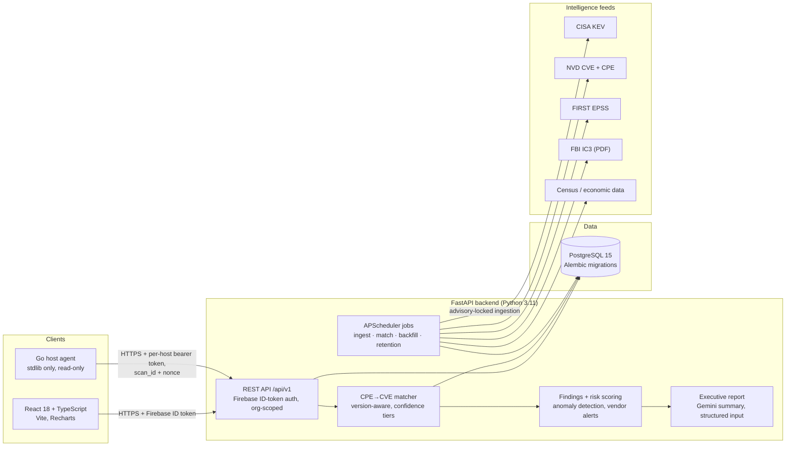

# Hacker Tracker

A cyber threat intelligence and asset-risk platform for small and mid-sized
businesses. It correlates an organization's software inventory with CVE, CISA
KEV and EPSS data, scores the organization's exposure against FBI IC3 loss
statistics, and turns the result into a prioritized remediation plan and a
plain-English executive report.

[](https://github.com/firegiant9000/Senior-Cybersecurity-Project/actions/workflows/ci.yml)
[](https://github.com/firegiant9000/Senior-Cybersecurity-Project/actions/workflows/matcher-regression.yml)

> **Status:** senior capstone project (six people, Spring 2026) that I kept
> developing through a Month 4 milestone. It runs end to end locally and has
> been deployed to a pilot environment for testing. It has no paying users, no
> certifications, and should be read as a working prototype, not a product.

## Why it exists

Small businesses and the MSPs that serve them rarely have a vulnerability
management program. They have a spreadsheet of software, a firewall, and a
vague sense that ransomware is expensive. Public data could tell them which of
their software is actively exploited (CISA KEV), how likely each CVE is to be
exploited in the next 30 days (EPSS), and what attacks cost businesses like
theirs (IC3), but nobody joins those sources for them.

Hacker Tracker does that join. An organization describes itself (sector,
size, state, vendors and software), uploads or scans its inventory, and gets
back: which CVEs actually affect the versions it runs, which of those are on
the KEV list, a risk score with the reasoning behind it, and a remediation
plan an owner can act on without reading a CVSS vector.

## Screenshots

Not captured yet. [docs/screenshots/README.md](docs/screenshots/README.md)
lists the five views to capture (dashboard, assets and findings, vendor
prioritization, remediation plan, executive report) and how to do it from a
demo-seeded local stack.

## Architecture



| Component | Where | Notes |
| --- | --- | --- |
| Backend | `backend/` | FastAPI, SQLAlchemy 2 async, Alembic (50 migrations), pytest |
| Frontend | `frontend/` | React 18, TypeScript, Vite, React Router, Recharts, Vitest |
| Host agent | `agent/` | Go 1.22, standard library only, Linux (dpkg/rpm, systemd, optional `ss`) |
| Auth | Firebase Authentication | Backend verifies ID tokens with the Admin SDK |
| Hosting | Render (API + Postgres), Firebase Hosting (web) | `render.yaml`, `firebase.json` |
| Errors | Sentry | No-op when the DSN is unset; PII scrubber on both sides |

## Core engineering highlights

- **Version-aware CPE→CVE matching with confidence tiers.**
  [`cpe_matcher.py`](backend/app/services/cpe_matcher.py) parses NVD affected-version
  ranges and compares installed versions against them. Each match is `high`
  (exact CPE), `medium` (name match, version inside a published range), `low`
  (name-only) or `needs_review` (version could not be parsed). It never guesses.
- **The matcher is regression-gated.**
  [`matcher-regression.yml`](.github/workflows/matcher-regression.yml) runs a
  known-good fixture set nightly and on every PR that touches the matcher, and
  fails below a 95% pass rate or above a 2% high-confidence false-positive rate.
- **KEV and EPSS drive prioritization.** Every matched CVE is enriched with
  its CVSS score, EPSS probability and KEV flag; a KEV hit changes the
  remediation text to "patch or remove now" and the findings report is sorted
  by severity. Vendor alerts rank product-specific matches above vendor-wide
  ones and surface trending KEV entries.
- **Ingestion that cannot trample itself.** Feeds run under APScheduler with a
  Postgres advisory lock per source
  ([`ingest_lock.py`](backend/app/services/ingest_lock.py)), so a manual run,
  a scheduled run and a second replica cannot ingest the same feed concurrently.
  IC3 data is parsed from the FBI's annual PDF with a fallback estimator when
  the layout changes.
- **Host agent with a real trust model.** One token per host, shown once,
  stored as a SHA-256 hash, rotatable with a 24-hour grace window, revocable
  instantly. Every upload carries a `scan_id` and `nonce`; duplicates inside
  the replay window are rejected with 409 and the replay marker is recorded in
  the same transaction as the import
  ([`inventory.py`](backend/app/api/routes/v1/inventory.py),
  [`agent_token.py`](backend/app/services/agent_token.py)).
- **Signed agent releases.** Tagging `agent-vX.Y.Z` builds linux/amd64 and
  arm64, writes `SHA256SUMS`, GPG-signs the manifest and publishes a GitHub
  Release. Without a signing key the release is marked as an unsigned
  prerelease rather than silently shipping
  ([`agent-release.yml`](.github/workflows/agent-release.yml)).
- **AI summaries with guarded input.** The executive summary prompt
  ([`ai_summary.py`](backend/app/services/ai_summary.py)) passes organization
  and finding data to Gemini as a structured JSON data block rather than free
  text, instructs the model to use only that data, and returns a schema-shaped
  response that is cached and versioned. This limits, but does not eliminate,
  prompt-injection risk from user-supplied names.
- **Statistical anomaly detection** over IC3 trends and vendor KEV velocity
  ([`anomaly_detection.py`](backend/app/services/anomaly_detection.py)).

## Security design

- **Authentication.** Users sign in through Firebase Authentication. The API
  verifies the ID token on every request with the Admin SDK and resolves the
  user's organization memberships and role (`admin` / `member`).
- **Authorization and data isolation.** Every organization-scoped route takes
  the org ID and checks membership server-side. Demo organizations are flagged
  and segregated. Data lifecycle endpoints allow per-org export and deletion,
  and a retention job prunes old scan runs and audit rows per org.
- **Agent tokens and replay protection.** Described above; the enrollment,
  rotation and revocation flow is documented in
  [docs/security/agent_enrollment.md](docs/security/agent_enrollment.md).
- **Rate limiting.** SlowAPI limits on auth and other sensitive routes.
- **Secrets.** All secrets come from environment variables. `.env.example`
  and `frontend/.env.example` list the names only. The app refuses to start in
  production with the default `SECRET_KEY` or a `localhost` CORS origin. The
  Firebase Admin key is read from `GOOGLE_APPLICATION_CREDENTIALS` or the
  `FIREBASE_SERVICE_ACCOUNT_JSON` variable and is gitignored.
- **Input boundaries.** Uploaded inventory files are size-limited and
  filename-sanitized; the agent payload is a versioned schema validated with
  Pydantic; AI prompts receive data as JSON, not interpolated prose.
- **Privacy.** What is collected and logged is documented in
  [docs/security/pii_inventory.md](docs/security/pii_inventory.md) and the
  user-facing [privacy page](docs/security/privacy.md). The agent never reads
  file contents, credentials or browser data.
- **Limitations.** No penetration test, no third-party audit, no SOC 2. Rate
  limits are per-process. The matcher's `low` tier can produce false positives
  and is labelled as such rather than hidden.

## My contributions — Arlo Kharod

Six people built this. The split below comes from `git log` and `git blame`
on `main` (395 of 560 commits are mine, across the identities listed in
[CONTRIBUTORS.md](CONTRIBUTORS.md)).

### Designed and implemented by me

- Version-aware CPE→CVE matcher, confidence tiers, false-positive handling,
  the known-good regression fixtures and the CI calibration gate
- Nightly matching and CPE backfill jobs; APScheduler background ingestion;
  Postgres advisory-lock concurrency protection
- EPSS ingestion and enrichment
- Go host inventory agent (all of `agent/`), agent token issue / verify /
  rotate / revoke, nonce-based replay protection, and the GPG-signed release
  workflow
- Gemini executive summaries with structured (JSON data block) prompting,
  response schema and cache versioning
- Statistical anomaly detection; vendor-matched alerts and vendor
  prioritization
- Authentication: the original JWT implementation, the migration to Firebase
  Authentication, and the security utilities
- IC3 fallback parser with sector estimation
- SMB onboarding wizard; assessment intake; demo-org segregation; data
  lifecycle (export / delete) and retention
- Most of the React dashboard: the analytics-tab rebuild, component
  reorganization, assets and findings views, executive report page, Firebase
  auth UI
- All three CI workflows; 45 of the 50 Alembic migrations; the majority of the
  644 backend tests

### Major contributions by me (originally built by a teammate)

- CISA KEV ingestion (Ethan Gagliano wrote it; I added startup auto-ingest,
  concurrency safety and hardening)
- IC3 ingestion (Ethan wrote the first PDF parser; roughly half of the current
  file is mine, including the fallback path)
- Executive summary endpoint and report page (Ethan built the first version;
  I rewrote it for an SMB audience and added intake integration and error
  handling)
- Onboarding routes (mine, with Ethan's membership-management refactor on top)

### Team-built, credited to others

- First backend scaffold: Postgres schema, initial FastAPI ingestion pipeline
  and risk-scoring function (Ethan Gagliano)
- NVD CVE ingestion and the economic-indicator (Census / BEA) ingestion
  (Ethan Gagliano; my changes there are formatting and CI fixes)
- Dark mode, theming, header and dropdown UX, tooltip fixes and frontend test
  scaffolding (Darrin Rious Jr.)
- Early ingestion tasks and dashboard components (Sean Winfield); early
  frontend work (Phat Nguyen); research and planning (Cody Kinney)

## Team

Ethan Gagliano, Arlo Kharod, Cody Kinney, Sean Winfield, Phat Nguyen and
Darrin Rious, as the CMPS 490 senior capstone team at the University of
Louisiana at Lafayette, Spring 2026. GitHub handles and commit counts are in
[CONTRIBUTORS.md](CONTRIBUTORS.md).

## Development and local setup

Prerequisites: Docker Desktop, or Python 3.11/3.12, Node 18+, PostgreSQL 14+
and Go 1.22 for a bare-metal setup. Full detail, including Windows notes, is
in [docs/SETUP.md](docs/SETUP.md).

```bash
cp .env.example .env                 # backend settings
cp frontend/.env.example frontend/.env
make up                              # postgres :5433, backend :8000, frontend :5174
make migrate                         # apply Alembic migrations
make down
```

**Sign-in requires a Firebase project.** Create a free one, enable
Email/Password auth, put the web config into `frontend/.env`, and download an
Admin SDK key to `backend/service-account.json` (gitignored; the compose file
mounts it). Without this the API runs and the health, ingest-status and public
endpoints answer, but you cannot log in to the dashboard. A credential-free
demo mode is on the to-do list.

The threat feeds (KEV, NVD, EPSS, IC3, Census) are public and need no keys.
An `NVD_API_KEY` raises the NVD rate limit; `GEMINI_API_KEY` enables AI
summaries; `SHODAN_API_KEY`, `HIBP_API_KEY` and `OTX_API_KEY` enable optional
Tier 2 findings. Everything degrades cleanly when unset.

Manual ingestion: `POST /api/v1/ingest/{source}`; status at
`GET /api/v1/ingest/status`. Agent: `make agent-build`, then
`hacker-tracker scan --print` to preview what a scan would upload.

## Tests

| Suite | Count | Command |
| --- | ---: | --- |
| Backend (pytest) | 644 test functions in 64 files | `make backend-test` or `cd backend && pytest` |
| Matcher regression | known-good fixture set, gated at 95% pass / 2% high-confidence FP | `pytest tests/regression` |
| Frontend (Vitest) | 466 `it`/`test` cases in 18 files | `cd frontend && npm test` |
| Agent (Go) | 9 test functions in 3 files | `make agent-test` |

CI ([`ci.yml`](.github/workflows/ci.yml)) runs ruff lint and format checks,
`alembic upgrade head` plus `alembic check` against a Postgres service, the
backend suite, ESLint and `tsc --noEmit`, the frontend suite, `go vet`,
`go test` and `go build`, then deploys previews and the production frontend.
[`matcher-regression.yml`](.github/workflows/matcher-regression.yml) runs
nightly. [`secret-scan.yml`](.github/workflows/secret-scan.yml) runs gitleaks
over full history on every push, PR and weekly.

## Limitations

- Capstone origin: some early modules (per-feed READMEs, first ingestion
  scripts) are kept under `docs/project-history/` as history, not as guidance.
- Prototype, not production: single-instance assumptions (in-process rate
  limits, scheduler in the API process), no HA, no backup drill run yet.
- Needs a Firebase project to log in; optional integrations (Gemini, Shodan,
  HIBP, OTX, Microsoft 365) need their own credentials.
- Agent supports Linux only (Debian/Ubuntu and RHEL/Fedora families). Windows
  and macOS agents are planned, not built.
- Matching accuracy depends on NVD CPE data quality. Software without a
  version, or with vendor-specific version strings, lands in the `low` or
  `needs_review` tier and needs a human look.
- IC3 statistics are national and per-sector, not per-company; the risk score
  is an estimate for prioritization, not an actuarial figure.

## License

[MIT](LICENSE). Contributors are listed in [CONTRIBUTORS.md](CONTRIBUTORS.md).
The dependencies are all permissively licensed and no third-party datasets
are redistributed; the CVE, KEV, EPSS, IC3 and Census data is fetched at
runtime from its public sources under their own terms.
